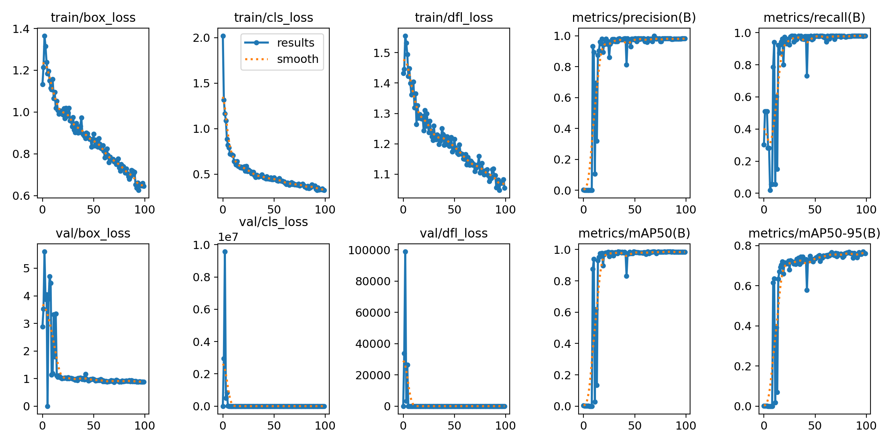
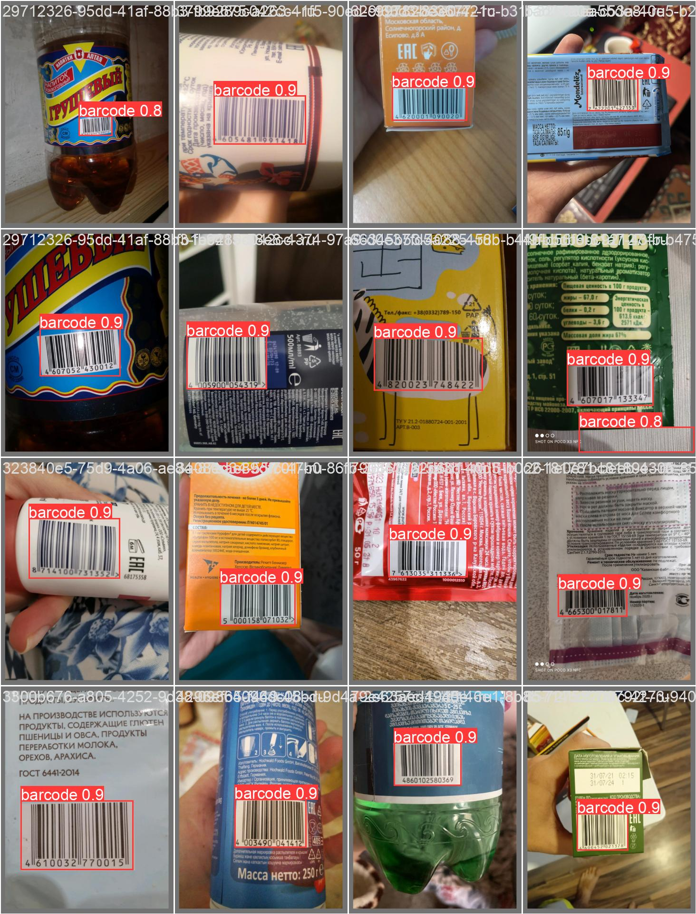

# deepschool-cvr-bcdetect

The model is trained to detect barcodes on images.
It was train on teh data from the link https://www.kaggle.com/datasets/kniazandrew/ru-goods-barcodes .

Result of the traing are located in `results` folder. 
You can also look on the traing result by the following link: 
https://app.clear.ml/projects/b0d06e368172415bb24bffdb7f1f6d04/experiments/b2c4b10bb1b44fada9f0c808f1fd21d2/output/execution

## instalation
To install model requiremants run `make install`.

## Data preparation 
To prepare data prepare config `data_prep.yml` and run `make prepare_data`.

## Train
To train the model set hyperparameters in config `barcodes.yml` and run `make train`.

## Evaluate on test
To evaluate the model on test data prepare config `barcodes_test.yml` and run `make test`

## Detailed info about experimets

You can find the detailed information about experiments here: 
- [ ] [Train run](./results/train)
- [ ] [Evaluation on test set](./results/test)

## Training metrics

## Examples on test set

